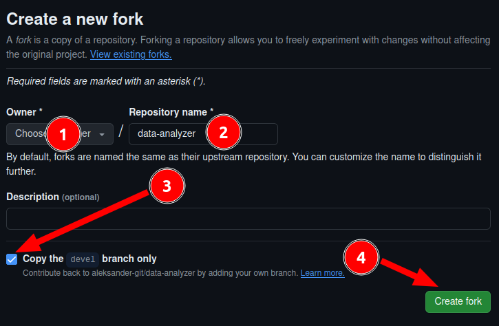

## Процесс работы с Pull request на проекте aleksander-git/data-analyzer

Прежде всего определим, что такое Pull Request (PR)

    Pull request - это предложение по внесению изменений в проект.

Это означает, что вы сделали что-то, что на ваш взгляд улучшит проект (дополнит его новым функционалом, исправит определенные ошибки, уберет ненужное и т.д.) и вы хотите, что бы владелец проекта (или те, у кого есть необходимы права) добавили в свой проект ваши изменения.

Перед созданием PR необходимо проделать следующее:

#### Для консольной версии (универсальное решение)

- или склонировать себе проект и работать с ним (не рекомендуется)

        git clone https://github.com/aleksander-git/data-analyzer

- или форкнуть проект в свой репозиторий и работать со своим репозиторием (лучший вариант)

  
Как сделать форк проекта github.com/aleksander-git/data-analyzer

  Переходим по адресу https://github.com/aleksander-git/data-analyzer
  Далее нажимаем кнопку Fork

  

  Затем, будет следующее окно, в котором нужно выбрать репозиторий (1), задать название репозитория (2), установить/убрать галочку (3), которая указывает, будет ли в ваш репозиторий добавлены все ветки или только основная. Затем необходимо нажать "Create fork" (4)

  

  После всех эти действий, нужно склонировать свой репозиторий к себе на свой компьютер

    git clone https://github.com/имя_вашего_аккаунта/имя_репозитория
  
  > :warning: **Важно!** Необходимо потом установить пул именно для удаленного репозитория https://github.com/aleksander-git/data-analyzer, если он не установлен, командой "git remote add upstream https://github.com/aleksander-git/data-analyzer" Затем брать актуальные данные ветки командой "git pull --rebase upstream devel"

    
    

#### Для версии для VSCode

Так же делаем форк проекта себе в репозиторий по схеме выше.
Склонируем свой проект в папку. Для этого нажимаем горячие клавиши 

    Ctrl+Shft+P

Или выбираем в меню Help -> Show All Commands.

В выпадающим списке выбираем

    Git:Clone -> Clone from GitHub 

Затем выбираем или свой форк проекта, если он сделан, или сам проект (не рекомендуется) и указываем его расположение. VSCode спросит, после клонирования, перейти ли в данную папку. Соглашаемся (или нет, но потом все равно придется ее открыть, что бы работать с проектом)

Затем убеждаемся, что у нас есть еще и удаленный репозиторий. Для этого "More Actions..." (1) -> Remote -> Remote Remote

Убеждаемся, что удаленный репозиторий есть. Обычно он называется "upstream" и указывает путь до нашего основного проекта.

Если вдруг там его нет, то его необходимо добавить. Для этого в том же меню выбираем "Add Remote" - "More Actions..." -> Remote -> Add Remote. Затем выбираем GitHub и наш основной удаленный репозиторий. После вводим имя (лучше upstream) и нажимаем Enter.
