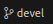

## Процесс работы с Pull request на проекте aleksander-git/data-analyzer

Прежде всего определим, что такое Pull Request (PR)

    Pull request - это предложение по внесению изменений в проект.

Это означает, что вы сделали что-то, что на ваш взгляд улучшит проект (дополнит его новым функционалом, исправит определенные ошибки, уберет ненужное и т.д.) и вы хотите, что бы владелец проекта (или те, у кого есть необходимы права) добавили в свой проект ваши изменения.

### Шаг №1

Перед созданием PR клонируем наш проект. Для это нужно сделать:

#### Для консольной версии

Склонировать себе проект и работать с ним

        git clone https://github.com/aleksander-git/data-analyzer

#### Для версии для VSCode

Клонируем свой проект в папку. Для этого нажимаем горячие клавиши 

    Ctrl+Shft+P

Или выбираем в меню **Help -> Show All Commands**.

В выпадающим списке выбираем

    Git:Clone -> Clone from GitHub 

Затем вводим адрес нашего проект "github.com/aleksander-git/data-analyzer". После выбираем папку, в которую будет склонирован проект. Потом VSCode спросит, нужно ли перейти в папку. Подтверждаем (или нет, но все равно надо будет открыть эту папку) и начинаем работать с нашим проектом.

### Шаг №2

После клонирования, нужно создать отдельную ветку в проекте. Это делается для того, что бы потом можно было сделать PR.

#### Для консольной версии

Создаем ветку и сразу же переключаемся на нее. Для примера, здесь новая ветка называется newBranch. Вместо newBranch введите свое название ветки. Это команда объединяет себе две команды - создания ветки и переключения на нее.

    git checkout -b newBranch

#### Для версии для VSCode

Для создания ветки в VSCode нужно в основном меню Git нужно нажать три точки **...** (More Actions...).

Далее выбираем **Branch -> Create Branch...**

Так же можно нажать  для быстро переключения на нужную ветку или создания новой ветки. Тут выбираем **+ Create new branch...**

После необходимо ввести имя новой ветки и нажать Enter. VSCode сам переключится на новую ветку. 

### Шаг №3

Публикуем нашу ветку

#### Для консольной версии

Вводим команду, где вместо newBranch наше название ветки

    git push -u origin newBranch

#### Для версии для VSCode

После создания новой ветки, вместо кнопки **Commit** появляется кнопка **Publish Branch**. Нажимаем ее (или через меню **... -> Branch -> Publish Branch...**)

### Шаг №4

Теперь все готово и можно, наконец, приступить к основной работе - писать код и коммитить его. После того, как все сделано и вы уверены, что ваша работа выполнена, можно приступить к созданию PR

### Шаг №5.1 - Создание Pull Request

#### Для веб версии

Переходим на github в наш проект

https://github.com/aleksander-git/data-analyzer/

Нажимаем **Pull requests** (1) **-> New pull request** (2)

Далее выбираем нужную нам ветку для PR

И нажимаем кнопку **Create pull request**

После мы получим примерно следующий результат

Здесь нужно заполнить поле **Add a title** (1), описать PR в разделе **Add a description** (2) (необязательно) 

> :warning: **Внимание!** Обратите внимание на то, из какой ветки (4) и в какую (5) вы хотите добавить данные (смерджить)!

Так же нужно добавить себя в поле **Assignees**.
Теперь нажимаем **Create pull request** (3)

Поздравляю! Вы создали свой Pull Request. Здесь вы можете создавать комментарии,просматривать комментарии и замечания других, закрыть свой PR и делать другие вещи.

#### Для VSCode

Для начала, установим разрешение GitHub Pull Requests. Для этого заходим в  **Extensions (Ctrl+Shift+X)**(1), вводим *GitHub Pull Requests* (2) и устанавливаем нужное разрешение (3)

Теперь мы можем создать PR с помощью расширения. Для этого нажимаем на расширении GitHub Pull Requests(1) и нажимаем кнопку **Create Pull Request** (2)

Далее попадаем в еще одно меню. Тут выбираем нужную ветку (1), которую надо добавить в основную (2). Обычно, если вы находитесь на ветке, которую хотите смерджить, то выбирается по умолчанию она и ветка, в которую надо влить данные, выбирается по-умолчанию основная. После вводим название PR в поле (3) (обычно там уже есть название, но можно поменять.) Можно ввести *Description*, но это необязательное поле. В конце, нажимаем кнопку **Create** (4)

Вот и все! Ваш PR в VScode создан!

### Шаг №5.2 - Ревью Pull Request

Важно не только выполнять задачи, но и просматривать задачи других людей и участвовать в Code Review - просмотра чужого кода на наличие ошибок, качество кода, полнота и понятность кода и т.д. Короче - рецензирование кода.

#### Через сайт github.com (web версия)

Переходим на наш проект, снова заходим в **Pull Request** (1) и выбираем любой понравившийся PR (2)

Теперь переходим во вкладку **Files changed** (1).

Здесь отображаются весь PR, а именно:

- (2): файлы, которые необходимо добавить для слияния  в основную ветку
- (3): изменения, которые буду в файлах основной ветки. Здесь можно оставлять свои комментарии в любой строчке кода - для этого надо подвести мышь к нужной строке, нажать **+** и написать свой комментарий
- (4): кнопка **Review changes** - нужна для создания комментариев (1), ободрения PR (2) и запрос на изменения PR (3). Что бы, напримр, одобрить PR, нужно нажать на **Approve** и затем кнопку **Submit review**

#### Code Review через VSCode

У вас должно быть установлено расширение GitHub Pull Requests (как оно устанавливается описывается выше)

Нажимаем на расширение GitHub Pull Requests (1), затем выбираем PR, который мы хотим рецензировать (2), нажимаем **Description** (3). У нас появится примерно такое же оформление, как на сайте  github.com. Чуть ниже **Description** можно увидеть список файлов на добавление в основную ветку (4). С каждым можно ознакомится, просто нажав на него мышкой. Если все в порядке с PR, то можно утвердить PR, нажав соответсвующую кнопку **Approve** (5)

При просмотре файлов так же можно оставлять своикомментарии в любом месте кода, просто подведя мышь к нужному месту и нажав кнопку **+**, которая появляется. И затем, появляется следующее окно, в котором можно написать свои комментарии к коду

Так же удобно просматривать все изменения, относительно основной ветки, если нажать кнопку **Open Changes**(1) возле кнопки **Description**

В целом, это общая информация о том, как работать с Pull Request.
Здесь рассмотрена только версия с клонированием. Не рассмотрена версия с форком (предпочтительнее делать клонировании в нашем случае).