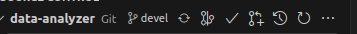

## Процесс работы с Pull request на проекте aleksander-git/data-analyzer

Прежде всего определим, что такое Pull Request (PR)

    Pull request - это предложение по внесению изменений в проект.

Это означает, что вы сделали что-то, что на ваш взгляд улучшит проект (дополнит его новым функционалом, исправит определенные ошибки, уберет ненужное и т.д.) и вы хотите, что бы владелец проекта (или те, у кого есть необходимы права) добавили в свой проект ваши изменения.

### Шаг №1

Перед созданием PR склонировать наш проект. Для это нужно сделать:

#### Для консольной версии

Склонировать себе проект и работать с ним

        git clone https://github.com/aleksander-git/data-analyzer

#### Для версии для VSCode

Клонируем свой проект в папку. Для этого нажимаем горячие клавиши 

    Ctrl+Shft+P

Или выбираем в меню **Help -> Show All Commands**.

В выпадающим списке выбираем

    Git:Clone -> Clone from GitHub 

Затем вводим адрес нашего проект "github.com/aleksander-git/data-analyzer". После выбираем папку, в которую будет склонирован проект. Потом VSCode спросит, нужно ли перейти в папку. Подтверждаем (или нет, но все равно надо будет открыть эту папку) и начинаем работать с нашим проектом.

### Шаг №2

После клонирования, нужно создать отдельную ветку в проекте. Это делается для того, что бы потом можно было сделать PR.

#### Для консольной версии

Создаем ветку и сразу же переключаемся на нее. Для примера, здесь новая ветка называется newBranch. Вместо newBranch введите свое название ветки. Это команда объединяет себе две команды - создания ветки и переключения на нее.

    git checkout -b newBranch

#### Для версии для VSCode

Для создания ветки в VSCode нужно в основном меню Git нужно нажать три точки **...** (More Actions...).

Далее выбираем **Branch -> Create Branch...**

Так же можно нажать  для быстро переключения на нужную ветку или создания новой ветки. Тут выбираем **+ Create new branch...**

После необходимо ввести имя новой ветки и нажать Enter. VSCode сам переключится на новую ветку. 

### Шаг №3

Публикуем нашу ветку

#### Для консольной версии

Вводим команду, где вместо newBranch наше название ветки

    git push -u origin newBranch

#### Для версии для VSCode

После создания новой ветки, вместо кнопки **Commit** появляется кнопка **Public branch**
